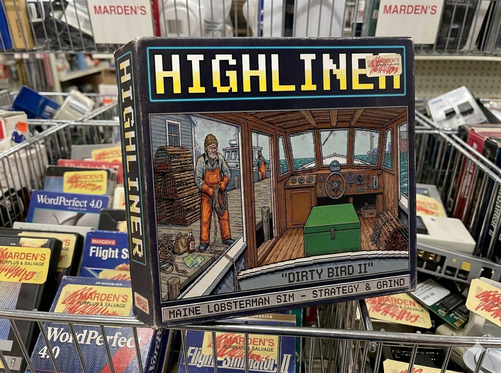

# 🦞 HIGHLINER



> *Bait. Set. Haul.*

A DOS-aesthetic terminal lobster fishing simulator set on the coast of Maine. Built with [Bubble Tea](https://github.com/charmbracelet/bubbletea). Runs in your terminal.

---

## What Is This

You're a Maine lobsterman. You wake up, check the weather, pick your grounds, and haul traps. Some days are good. Some days a gale pins you in the harbor and costs you $20 just to sit there. Sometimes you find a bale of square grouper tangled in your buoy line and have to make a call.

This is a strategy/grind sim — manage your gear, your cash, your fuel, and your vices. Buy better equipment. Upgrade your boat. Don't go broke.

---

## Features

- **Animated haul log** — the day plays out line by line: 0600 you leave the dock, 1100 you check in, 1430 last trap aboard. Hit SPACE to skip.
- **7 fishing zones** — from nearshore ledges to deep water drop-offs. Deeper = better lobster, more trap loss, more fuel.
- **Realistic gear economics** — commercial trap prices ($150–175/trap), marine diesel ($4–5.50/gal), fresh herring bait ($0.40–0.80/lb). Prices roll daily.
- **Grade-based pricing** — Chix, Quarters, Selects, Jumbos, Super Jumbos, Culls. Zone determines your grade mix.
- **Equipment system** — Radar (fog access), GPS/Chartplotter (offshore zones), VHF Radio (distress events), Upgraded Hauler, Depth Sounder, Exhaust Heat Exchanger.
- **Random mid-haul events** — berried hen (keep or throw back?), square grouper, Jonah crabs, ghost trap, boat in distress, storm coming in. Pause the animation and make a call.
- **Trap loss** — 2% per trap in normal conditions, 5% in SCA. Deeper zones add more risk. Upgraded hauler helps.
- **Weather system** — Clear, Fog, Small Craft Advisory, Gale. Fog without radar locks you to nearshore zones. SCA is fishable but rough.
- **Evening vices** — Allen's Coffee Brandy, Six-Pack of Natty, scratch tickets, or early bed. Three nights running and you're hungover, can't fish.
- **Dock fee** — $20/day whether you fish or not. The slip doesn't care about the weather.
- **Fleet progression** — Eastern 22 → Calvin Beal 34 → Duffy 35 → Young Bros 40 → Wesmac 46.
- **Persistent save** — saves after every meaningful action.

---

## Running It

```bash
git clone https://github.com/ngmaloney/highliner-game.git
cd highliner-game
go build -o highliner .
./highliner
```

Requires Go 1.21+. Terminal should be at least 120×40 for best experience.

---

## Controls

| Key | Action |
|-----|--------|
| `1–4` | Switch tabs (Log / Maintenance / Dock / Wharf) |
| `↑↓` / `JK` | Scroll log / navigate menus |
| `PgUp/PgDn` | Scroll log |
| `ENTER` | Confirm / fish |
| `SPACE` | Skip haul animation |
| `S` | Stay in port |
| `W` | Jump to Wharf |
| `M` | Jump to Maintenance |
| `Q` | Save and quit |

---

## The Zones

| Zone | Description | Notes |
|------|-------------|-------|
| A — Nearshore Ledges | Close in, well-picked | Always accessible |
| B — Eastern Bay | Mid-range, decent grounds | Fog: need radar |
| C — The Mudhole | Deep soft bottom, good keepers | Fog: need radar |
| D — Green Island Shoals | Classic zone, reliable | Fog: need radar |
| E — Outer Ledges | Far out, big lobster | Eastern 22 max range |
| F — The Rip | Rough crossing, premium grounds | Need GPS + bigger boat |
| G — Deep Water Drop-off | Long steam, cold water giants | Need GPS + bigger boat |

---

## Equipment

| Item | Cost | Effect |
|------|------|--------|
| Radar | $1,200 | Fish all zones in fog |
| GPS/Chartplotter | $800 | Unlocks zones F and G |
| VHF Radio | $250 | Weather forecast + distress events |
| Upgraded Hauler | $600 | Slower hydraulic wear, less trap loss |
| Depth Sounder | $400 | Full catch efficiency in deep zones (D–G) |
| Exhaust Heat Exchanger | $3,000 | Reduces engine wear by 60% per haul |

---

## Built With

- [Bubble Tea](https://github.com/charmbracelet/bubbletea) — TUI framework
- [Lip Gloss](https://github.com/charmbracelet/lipgloss) — terminal styling
- [Bubbles](https://github.com/charmbracelet/bubbles) — viewport component

---

*Pull or perish.*
